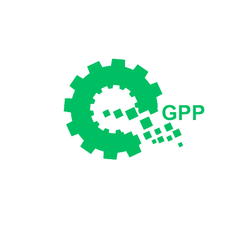
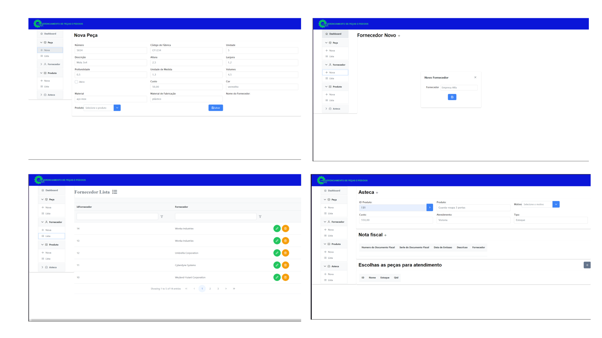
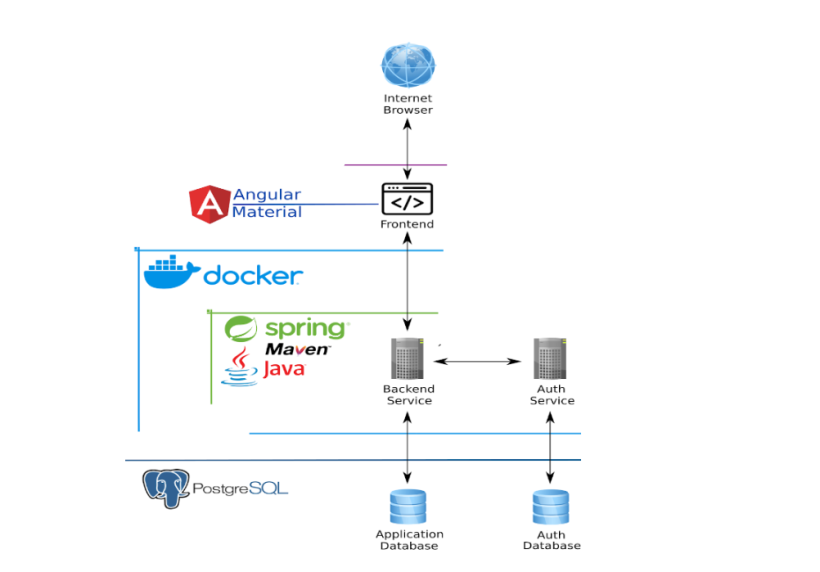

    

 
 
 

    

 
<h2>Sistema de Gerenciamento de Peças e Pedidos</h2>
<h3> 1 - Visão Geral do Software </h3>

O sistema de assistência técnica terceirizada é uma solução implementada por uma empresa para fornecer suporte após a venda. Os dados do cliente e do produto são enviados ao sistema gerando a nota fiscal da empresa para que caso ocorra algum problema, será a partir desta nota fiscal que será iniciado o atendimento. Técnicos qualificados são designados para lidar com o suporte, e o progresso é acompanhado. Após a resolução, são registradas as informações de fechamento e o sistema gera relatórios para a empresa. Em resumo, o sistema garante suporte eficiente, resolução de problemas e satisfação do cliente após a venda.

<h4> 1.1 - Objetivo do Software </h4>

   O objetivo do Gerenciamento de Peças e Pedidos - GPP é fornecer um suporte eficiente e de qualidade aos clientes após a venda de um produto ou serviço. Ele busca garantir a resolução rápida e eficaz de problemas técnicos, promovendo a satisfação do cliente e fortalecendo a reputação da empresa. O software visa facilitar o gerenciamento dos casos de assistência, desde o registro inicial até o fechamento do chamado, proporcionando uma experiência positiva e um atendimento personalizado aos clientes.

    

<h4> 1.2 - Escopo do Projeto e Requisitos de Software </h4>

O projeto envolve o desenvolvimento de um sistema de assistência técnica terceirizada para fornecer suporte aos clientes após a venda de produtos ou serviços. 

O escopo inclui as seguintes funcionalidades:

<li><b> 1 - Registro de casos:</b> O sistema permitirá o registro de novos casos de assistência técnica, incluindo informações do cliente, detalhes do produto, número de série e garantia.
<li><b> 2 - Acompanhamento de casos:</b> O sistema permitirá o acompanhamento do progresso dos casos de assistência técnica, registrando interações entre o cliente e o técnico, atualizações de status e soluções propostas.
<li><b>3 - Comunicação com clientes:</b> O sistema facilitará a comunicação entre os técnicos e os clientes, permitindo o envio de mensagens, agendamento de visitas técnicas e obtenção de informações adicionais sobre os problemas enfrentados.
<li><b>4 - Registro de soluções: O</b> sistema registrará as soluções adotadas para resolver os problemas dos clientes, incluindo peças substituídas, procedimentos realizados e qualquer outra ação tomada.
<li><b>5 - Fechamento de casos:</b> O sistema permitirá o registro das informações de fechamento dos casos, incluindo a descrição da solução adotada e o feedback do cliente.

 

 Fundamentado nas necessidades levantadas com o cliente, foram identificados os seguintes requisitos funcionais :
 
 

<table>
    <thead>
    <tr>
        <th>ID</>
        <th> Nome </th>
        <th>DESCRIÇÃO</>
    </tr>
    </thead>
    <tbody>
        <tr>
            <td><b>RF01</b></td>
            <td><b>Casos</b></td>
            <td>O sistema deve permitir o registro de novos casos de assistência técnica, incluindo informações do cliente, detalhes do produto, número de série e garantia.</td>
        </tr>
        <tr>
            <td><b>RF02</b></td>
            <td><b>Progresso</b></td>
            <td>O sistema deve permitir o acompanhamento do progresso dos casos de assistência técnica, registrando interações entre o cliente e o técnico, atualizações de status e soluções propostas.</td>
        </tr>
        <tr>
            <td><b>RF03</b></td>
            <td><b>Técnicos</b></td>
            <td>O sistema deve permitir a designação de técnicos qualificados para lidar com os casos de assistência técnica, levando em consideração a disponibilidade e as habilidades necessárias.</td>
        </tr>
        <tr>
            <td><b>RF04</b></td>
            <td><b>Soluções</b></td>
            <td>O sistema deve registrar as soluções adotadas para resolver os problemas dos clientes, incluindo peças substituídas, procedimentos realizados e outras ações tomadas.</td>
        </tr>
     
</table>

 
<h4> 1.3 - Modelo de Domínio </h2>

O modelo de domínio do GPP - Gerenciamento de Peças e Pedidos foi cuidadosamente desenvolvido para oferecer uma representação clara e estruturada dos principais elementos do processo de suporte e atendimento ao cliente. Esse modelo nos permite compreender e visualizar a forma como cada parte se relaciona e interage, o que resulta em uma gestão eficaz dos casos de assistência técnica.

    

 
<h3> 2 - Arquitetura do Software </h2>

 A arquitetura do nosso software de assistência técnica terceirizada foi desenvolvida com o objetivo de oferecer um sistema flexível, escalável e de alta eficiência. Com uma abordagem moderna e orientada a serviços, nossa arquitetura permite uma gestão eficaz dos casos de assistência técnica, garantindo uma experiência de suporte aprimorada para nossos clientes.

    

<h4> 2.1 - Tecnologias da implementação </h2>
 

As principais tecnologias de implementação utilizadas em nosso projeto foram:

 
<ul>
<li><b>Docker: </b>Docker é uma plataforma que utiliza a tecnologia de contêineres para simplificar o empacotamento e distribuição de aplicativos. Ele cria ambientes isolados e padronizados, permitindo que os aplicativos sejam executados de maneira consistente em diferentes sistemas operacionais, facilitando a implantação e o gerenciamento.</li>
<li><b>Angular:</b> Angular é um framework desenvolvido pelo Google, focado no desenvolvimento de aplicações web front-end. Com a utilização de componentes reutilizáveis, ele permite a criação de interfaces de usuário dinâmicas e responsivas. Recursos como data binding (ligação de dados), injeção de dependência e roteamento simplificam o desenvolvimento de aplicações complexas.
</li>
<li><b>Spring Boot:</b> Spring Boot é um framework para o desenvolvimento de aplicativos Java que facilita a criação de aplicações autônomas e prontas para produção. Ele oferece uma configuração rápida e automática de componentes comuns do ecossistema Spring, permitindo que os desenvolvedores se concentrem na lógica de negócios em vez de gastar tempo configurando e integrando diferentes camadas do aplicativo.</li>
<li><b>PostgreSQL:</b> PostgreSQL é um sistema de gerenciamento de banco de dados relacional de código aberto e altamente escalável. Ele possui recursos avançados, como suporte a consultas complexas, transações ACID (Atomicidade, Consistência, Isolamento e Durabilidade), replicação e extensibilidade. O PostgreSQL é amplamente utilizado em aplicações que exigem um banco de dados confiável e poderoso, fornecendo uma base sólida para o armazenamento e manipulação de dados.</li>
</ul>
 
<h3> Referências </h3>
 
<ol>
<li>Docker. Disponível em: https://www.docker.com/. Acesso em: 16 maio 2023.</li>
<li>Angular. Disponível em: https://angular.io/. Acesso em: 16 maio 2023.</li>
<li>Spring Boot. Disponível em: https://spring.io/projects/spring-boot. Acesso em: 16 maio </li>
<li>PostgreSQL. Disponível em: https://www.postgresql.org/. Acesso em: 16 maio 2023.</li>
<li>TypeScript. Disponível em: https://www.typescriptlang.org/. Acesso em: 16 maio 2023.</li>
<li>Java. Disponível em: https://www.java.com/. Acesso em: 16 maio 2023.</li>
</ol>
 
